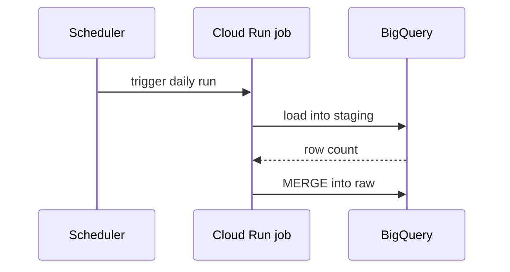

Use this template for writing the PR body:

```markdown
## Summary

<diagram, diff-sketch, or tree>

## Evidence

- **Before:** <query result/assertion run/failing test run>
  **After:** <query result/assertion run/passing test run>

## Merge Danger

**Door:** <one-way or two-way>

<optional: description>

**Blast Radius:** <one-word description>

<optional: potential ramifications of merge>
```

## Sections

Skip all preambles and keep prose brief. Use the project's domain language from `CONTEXT.md`.

### Summary

Pick the smallest view that makes the key point clear.

- Show transformation or metric logic as pseudocode:

```text
active_users(day)
  take events on day, excluding internal accounts
  keep users with >= 1 qualifying event
  count distinct user_id
```

- Show a pipeline's runtime control flow as a call tree:

```text
run_ingestion
  fetch_page
    refresh_token
  write_to_staging
  merge_into_raw
```

- Show where a model sits in the Dataform graph as a dependency tree, including the grain where it matters:

```text
mart_daily_revenue          (one row per day × country)
  int_orders_enriched       (one row per order)
    stg_orders
    stg_fx_rates
```

- Show file responsibility or a broad refactor as a shallow file tree:

```text
definitions/
├── staging/        # 1:1 with sources, renames and casts only
├── intermediate/   # joins and business logic
└── marts/          # what dashboards read
```

- Show data flow or interaction between systems with Mermaid:



- Use `diff` when the point is what changes and the surrounding shape already exists. Match the diff shape to the topic.

For a Dataform graph change:

```diff
 mart_daily_revenue
   int_orders_enriched
     stg_orders
-    stg_fx_rates
+    stg_fx_rates_daily
+  int_refunds
```

For a table's shape (grain and columns):

```diff
 mart_daily_revenue   one row per day × country
   day             DATE
   country         STRING
   gross_revenue   NUMERIC
+  net_revenue     NUMERIC   gross minus refunds
-  orders          INT64
+  order_count     INT64
```

For a file-layout change:

```diff
 definitions/
 ├── staging/
+│   └── stg_refunds.sqlx      # new source
 ├── intermediate/
-└── marts/revenue.sqlx
+└── marts/
+    ├── mart_daily_revenue.sqlx
+    └── mart_monthly_revenue.sqlx
```

For a call-tree change:

```diff
 run_ingestion
   fetch_page
+    retry_on_429
   write_to_staging
-  merge_into_raw
+  dedupe_on_event_id
+  merge_into_raw
```

- Show the whole block when most of it is new, when omitted context would hide ownership or order, or when the reader needs a copyable target shape, such as a `config` block:

```sqlx
config {
  type: "incremental",
  uniqueKey: ["order_id"],
  bigquery: { partitionBy: "DATE(created_at)" },
  assertions: { nonNull: ["order_id"], uniqueKey: ["order_id"] }
}
```

#### Guidance

Place each visual next to the short text it supports. Keep only the models, columns, calls, files and boundaries needed to answer the reviewer's question.

You may use one of these, you may use several, it is unlikely you will use all of them. Use your judgement and don't overwhelm the reader.

### Evidence

Concrete evidence that the change works. Show a before and after.

Query output is S-tier when the change is to data: the same bounded query run against the old and the new table on a dev dataset, with the numbers that moved (row count, a key metric, a reconciliation total). Put the query in the PR so the reviewer can rerun it.

Execution-based evidence is A-tier: `pytest` results, Dataform assertion results, `dataform compile` or a dry run listing the actions the change implies, a Vertex AI eval metric before and after. Show the exact test or assertion that now fails and passes, using pseudocode.

### Merge Danger

Describe whether it's a one-way or two-way door. You can walk back through two-way doors, but not one-way doors. A PR that is cheap to roll back is lower risk. One-way doors in this stack: dropping or overwriting a table, a full refresh of an incremental table whose source no longer holds the history, a backfill that rewrites published numbers, changing a metric definition stakeholders already report on, swapping the model behind a live endpoint.

The blast radius is the potential impact or scope of the changes introduced by this PR. Consider all possibilities: downstream Dataform models, dashboards and reports reading the table, scheduled jobs, consumers of a renamed column, query cost of a backfill, callers of a Vertex AI endpoint.
